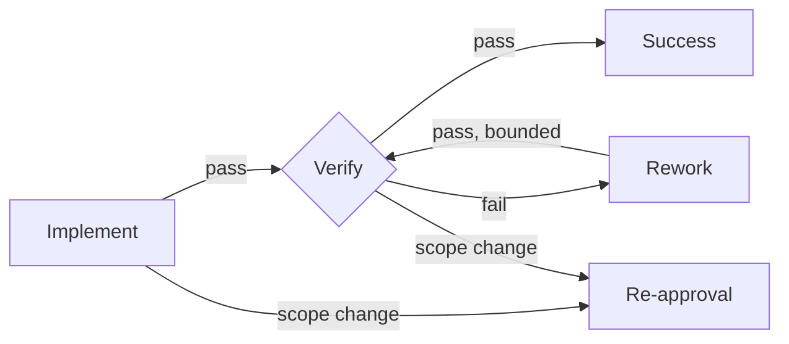

# Orchestrating Development Graphs

[简体中文](README.zh-CN.md)

A Codex and Claude Code skill that selects the smallest reliable development workflow and uses a persistent executable graph only when a change is genuinely complex.

This is not a wrapper that sends every task through the same heavyweight pipeline:

| Class | Typical signals | Route |
| --- | --- | --- |
| Simple | Local, mechanical, low risk, easy rollback | `Implement -> focused Verify` |
| Standard | Bounded observable behavior change | `Spec -> Plan -> TDD batches -> Verify` |
| Complex | Cross-module flow, persistence, migration, concurrency, permissions, security, build/dependency risk | Approved Spec/Plan plus an executable JSON graph |

## What makes the Complex route executable

The JSON graph is a persistent state machine, not a diagram-only artifact. It records:

- ready, running, passed, failed, blocked, and skipped node states;
- explicit pass, fail, blocked, and scope-change transitions;
- bounded retry and rework loops;
- append-only, SHA-256-chained evidence history;
- required gates that cannot be bypassed on a successful path;
- a synchronized, dependency-free SVG preview.



## Dependencies

| Component | Required when | Purpose |
| --- | --- | --- |
| This Skill | Every routed development task | Classification and workflow rules |
| Python 3.10+ **or** Node.js 18+ | Complex route only | Execute and preview the persistent graph |
| Superpowers | Optional | Reusable brainstorming, planning, TDD, debugging, and verification handlers |
| `bounded-plan-execution` | Optional | Bounded execution of an approved Plan |
| `AGENTS.md` / `CLAUDE.md` template | Optional but recommended | Trigger this Skill before other development workflows |

**Superpowers is not a prerequisite.** If a named companion skill is unavailable, the current agent performs the equivalent discipline directly. Simple and Standard tasks do not probe Python or Node.js. Both graph executors use only their standard libraries, with no pip or npm packages.

If you want the optional integration, follow the [official Superpowers installation guide](https://github.com/obra/superpowers#installation). In Claude Code, use `/plugin install superpowers@claude-plugins-official`; in the Codex app, install Superpowers from the Plugins sidebar.

## Installation

Agent-ready request: `Install this repository as an orchestrating-development-graphs Skill for my current host. If the target exists, update it with pull --ff-only; otherwise create the parent directory and clone it. Run the documented smoke test and report the installed absolute path.`

### Codex

Ask Codex to install this repository with `skill-installer`, or use the manual commands below. Do not clone over an existing installation; use the update command instead.

First installation on PowerShell:

```powershell
$skillParent = Join-Path $env:USERPROFILE ".codex\skills"
$skillRoot = Join-Path $skillParent "orchestrating-development-graphs"
New-Item -ItemType Directory -Force -Path $skillParent | Out-Null
git clone https://github.com/xincheng-1999/orchestrating-development-graphs.git $skillRoot
```

First installation on macOS/Linux:

```bash
mkdir -p "$HOME/.codex/skills"
git clone https://github.com/xincheng-1999/orchestrating-development-graphs.git \
  "$HOME/.codex/skills/orchestrating-development-graphs"
```

Update an existing installation:

```powershell
git -C "$env:USERPROFILE/.codex/skills/orchestrating-development-graphs" pull --ff-only
```

```bash
git -C "$HOME/.codex/skills/orchestrating-development-graphs" pull --ff-only
```

Restart Codex or begin a new task after installation so the skill catalog is refreshed.

### Claude Code

First user installation on PowerShell:

```powershell
$skillParent = Join-Path $env:USERPROFILE ".claude\skills"
$skillRoot = Join-Path $skillParent "orchestrating-development-graphs"
New-Item -ItemType Directory -Force -Path $skillParent | Out-Null
git clone https://github.com/xincheng-1999/orchestrating-development-graphs.git $skillRoot
```

First user installation on macOS/Linux:

```bash
mkdir -p "$HOME/.claude/skills"
git clone https://github.com/xincheng-1999/orchestrating-development-graphs.git \
  "$HOME/.claude/skills/orchestrating-development-graphs"
```

Update an existing user installation:

```powershell
git -C "$env:USERPROFILE/.claude/skills/orchestrating-development-graphs" pull --ff-only
```

```bash
git -C "$HOME/.claude/skills/orchestrating-development-graphs" pull --ff-only
```

For a team-shared project installation, add the Skill as a Git submodule from the project root.

PowerShell:

```powershell
New-Item -ItemType Directory -Force -Path ".claude\skills" | Out-Null
git submodule add https://github.com/xincheng-1999/orchestrating-development-graphs.git `
  ".claude/skills/orchestrating-development-graphs"
```

macOS/Linux:

```bash
mkdir -p .claude/skills
git submodule add https://github.com/xincheng-1999/orchestrating-development-graphs.git \
  .claude/skills/orchestrating-development-graphs
```

Start a new Claude Code session, then invoke `/orchestrating-development-graphs` or ask Claude to classify a development task with the Skill.

To make routing automatic for every development change, copy the relevant rule template into your repository root:

- Codex: [`examples/AGENTS.md`](examples/AGENTS.md)
- Claude Code: [`examples/CLAUDE.md`](examples/CLAUDE.md)

## Claude Code compatibility

- Claude Code reads the standard `SKILL.md`, `references/`, and `scripts/` content directly.
- `agents/openai.yaml` is optional Codex display metadata; Claude Code can ignore it.
- The named companion skills are optional. Superpowers is not a prerequisite; install it if desired, otherwise this Skill tells Claude to apply the same planning, debugging, TDD, and verification disciplines directly.
- Python 3.10+ and Node.js 18+ commands are host-independent. No pip or npm packages are required.
- Repository instructions belong in `CLAUDE.md` for Claude Code and `AGENTS.md` for Codex. The supplied examples keep their routing policy aligned.

## Verify the installation

Resolve the installed directory as `SKILL_ROOT`, then run either smoke test from any working directory:

```powershell
python "<SKILL_ROOT>/scripts/dev_graph.py" validate "<SKILL_ROOT>/examples/development-graph.json"
node "<SKILL_ROOT>/scripts/dev_graph.mjs" validate "<SKILL_ROOT>/examples/development-graph.json"
```

Each available runtime must print `VALID: <path>`. Then start a new host session and ask it to use `orchestrating-development-graphs` to classify “fix one README typo”; the expected class is Simple with `Implement -> focused Verify`.

## CLI

Python and Node.js expose the same graph commands:

```text
init <graph> [--output <path>] [--approval-evidence <text>]
validate <graph>
ready <graph>
start <graph> <node>
pass <graph> <node> --evidence <text> [--output <text>]
fail <graph> <node> --evidence <text> [--output <text>]
block <graph> <node> --evidence <text> [--output <text>]
scope-change <graph> <node> --evidence <text> [--output <text>]
status <graph>
render <graph> [--output <preview.svg>]
```

Examples:

```powershell
python "<SKILL_ROOT>/scripts/dev_graph.py" validate "<TARGET_ROOT>/docs/superpowers/graphs/change.json"
python "<SKILL_ROOT>/scripts/dev_graph.py" render "<TARGET_ROOT>/docs/superpowers/graphs/change.json"

node "<SKILL_ROOT>/scripts/dev_graph.mjs" init "<TARGET_ROOT>/docs/superpowers/graphs/change.json"
node "<SKILL_ROOT>/scripts/dev_graph.mjs" ready "<TARGET_ROOT>/docs/superpowers/graphs/change.json"
```

Without `--output`, `render path/name.json` creates `path/name.svg`. Mutating commands also refresh the same-name SVG automatically so the preview follows runtime state.

## Safety boundaries

The executor validates orchestration state only. It never runs tests, builds, migrations, deployments, shells, or arbitrary task commands. In particular, the Node.js implementation does not import `node:child_process`.

Graph definitions reject unbounded cycles, missing gate failure routes, required-gate bypasses, invalid snapshots, tampered history chains, and retry counters outside the shared safe-integer range.

## Tests

```powershell
python -m unittest discover -s tests -p "test_*.py" -v
node --test tests/test_dev_graph.mjs
```

The suite covers static validation, state transitions, retry limits, re-approval, tamper detection, completion, SVG safety, automatic preview refresh, canonical hashes, and Python/Node interoperability.

## Repository layout

```text
SKILL.md
agents/openai.yaml
examples/AGENTS.md
examples/CLAUDE.md
examples/development-graph.json
references/graph-schema.md
scripts/dev_graph.py
scripts/dev_graph.mjs
tests/test_dev_graph.py
tests/test_dev_graph.mjs
tests/test_skill_contract.py
```

## License

[MIT](LICENSE)
