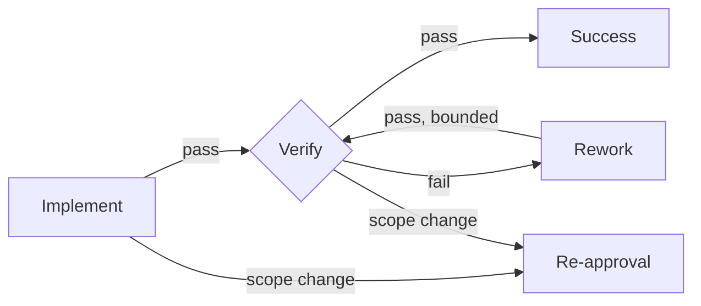

# Orchestrating Development Graphs

[简体中文](README.zh-CN.md)

A Codex skill that selects the smallest reliable development workflow and uses a persistent executable graph only when a change is genuinely complex.

This is not a wrapper that sends every task through the same heavyweight pipeline:

| Class | Typical signals | Route |
| --- | --- | --- |
| Simple | Local, mechanical, low risk, easy rollback | `Implement -> focused Verify` |
| Standard | Bounded observable behavior change | `Spec -> Plan -> TDD batches -> Verify` |
| Complex | Cross-module flow, persistence, migration, concurrency, permissions, security, build/dependency risk | Approved Spec/Plan plus an executable JSON graph |

## What makes the Complex route executable

The JSON graph is a persistent state machine, not a diagram-only artifact. It records:

- ready, running, passed, failed, blocked, and skipped node states;
- explicit pass, fail, blocked, and scope-change transitions;
- bounded retry and rework loops;
- append-only, SHA-256-chained evidence history;
- required gates that cannot be bypassed on a successful path;
- a synchronized, dependency-free SVG preview.



## Requirements

Complex graph execution needs one of:

- Python 3.10 or newer, preferred when available; or
- Node.js 18 or newer, used as the fallback.

Simple and Standard tasks do not probe either runtime. Both executors use only their standard libraries; there are no pip or npm runtime dependencies.

The orchestration skill routes node work to these companion skills when relevant:

- `superpowers:brainstorming`
- `superpowers:writing-plans`
- `superpowers:test-driven-development`
- `superpowers:systematic-debugging`
- `superpowers:verification-before-completion`
- `bounded-plan-execution`, when available

Install those separately; they are referenced by name and are not vendored here.

## Installation

Ask Codex to install this repository with `skill-installer`, or clone it directly.

PowerShell:

```powershell
git clone https://github.com/xincheng-1999/orchestrating-development-graphs.git `
  "$env:USERPROFILE\.codex\skills\orchestrating-development-graphs"
```

macOS/Linux:

```bash
git clone https://github.com/xincheng-1999/orchestrating-development-graphs.git \
  "$HOME/.codex/skills/orchestrating-development-graphs"
```

Restart Codex or begin a new task after installation so the skill catalog is refreshed.

## CLI

Python and Node.js expose the same graph commands:

```text
init <graph> [--output <path>] [--approval-evidence <text>]
validate <graph>
ready <graph>
start <graph> <node>
pass <graph> <node> --evidence <text> [--output <text>]
fail <graph> <node> --evidence <text> [--output <text>]
block <graph> <node> --evidence <text> [--output <text>]
scope-change <graph> <node> --evidence <text> [--output <text>]
status <graph>
render <graph> [--output <preview.svg>]
```

Examples:

```powershell
python scripts/dev_graph.py validate docs/superpowers/graphs/change.json
python scripts/dev_graph.py render docs/superpowers/graphs/change.json

node scripts/dev_graph.mjs init docs/superpowers/graphs/change.json
node scripts/dev_graph.mjs ready docs/superpowers/graphs/change.json
```

Without `--output`, `render path/name.json` creates `path/name.svg`. Mutating commands also refresh the same-name SVG automatically so the preview follows runtime state.

## Safety boundaries

The executor validates orchestration state only. It never runs tests, builds, migrations, deployments, shells, or arbitrary task commands. In particular, the Node.js implementation does not import `node:child_process`.

Graph definitions reject unbounded cycles, missing gate failure routes, required-gate bypasses, invalid snapshots, tampered history chains, and retry counters outside the shared safe-integer range.

## Tests

```powershell
python -m unittest discover -s tests -p "test_*.py" -v
node --test tests/test_dev_graph.mjs
```

The suite covers static validation, state transitions, retry limits, re-approval, tamper detection, completion, SVG safety, automatic preview refresh, canonical hashes, and Python/Node interoperability.

## Repository layout

```text
SKILL.md
agents/openai.yaml
references/graph-schema.md
scripts/dev_graph.py
scripts/dev_graph.mjs
tests/test_dev_graph.py
tests/test_dev_graph.mjs
```

## License

[MIT](LICENSE)
