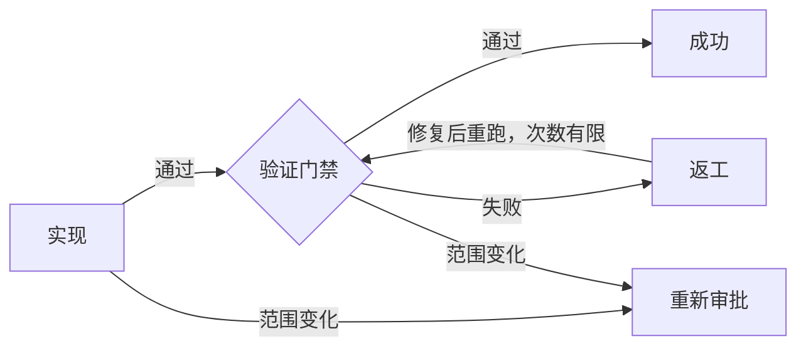

# 开发图编排 Skill

[English](README.md)

这是一个同时适用于 Codex 和 Claude Code 的 Skill：先判断开发任务的复杂度，再选择足够可靠且不过度的工作流。只有真正复杂的改动才创建持久化、可执行的开发图。

它不会把所有任务都塞进同一套重流程：

| 分类 | 典型信号 | 路线 |
| --- | --- | --- |
| Simple | 局部、机械、低风险、容易回滚 | `Implement -> focused Verify` |
| Standard | 范围明确的可观察行为变化 | `Spec -> Plan -> TDD batches -> Verify` |
| Complex | 跨模块、持久化、迁移、并发、权限、安全、构建或依赖风险 | 已审批 Spec/Plan + 可执行 JSON Graph |

## 为什么这是真正的 Graph Engineering

Complex 路线中的 JSON 不是用来展示的静态流程图，而是持久化状态机：

- 记录 `ready/running/passed/failed/blocked/skipped` 状态；
- 只允许沿 `pass/fail/blocked/scope_change` 边迁移；
- 重试和返工循环必须有明确上限；
- 历史只追加，并通过 SHA-256 哈希链防止静默篡改；
- 成功路径不能绕过必要门禁；
- 自动生成并刷新零依赖 SVG 预览。



## 环境要求

Complex 图执行至少需要一个运行时：

- 优先使用 Python 3.10+；
- Python 不可用时回退 Node.js 18+。

Simple 和 Standard 不探测运行时。两个执行器都只使用标准库，没有 pip 或 npm 运行依赖。

Skill 会按节点场景引用以下配套 Skill，仓库不会复制它们的源码：

- `superpowers:brainstorming`
- `superpowers:writing-plans`
- `superpowers:test-driven-development`
- `superpowers:systematic-debugging`
- `superpowers:verification-before-completion`
- 可用时使用 `bounded-plan-execution`

这些配套 Skill 可以单独安装。当前宿主没有某个配套 Skill 时，Agent 会直接执行同等的规划、调试、TDD 或验证纪律；只有 Complex 图执行所需的 Python 或 Node.js 是硬依赖。

## 安装

### Codex

可以让 Codex 使用 `skill-installer` 安装本仓库，也可以直接克隆。

PowerShell：

```powershell
git clone https://github.com/xincheng-1999/orchestrating-development-graphs.git `
  "$env:USERPROFILE\.codex\skills\orchestrating-development-graphs"
```

macOS/Linux：

```bash
git clone https://github.com/xincheng-1999/orchestrating-development-graphs.git \
  "$HOME/.codex/skills/orchestrating-development-graphs"
```

安装后重启 Codex 或新建任务，让 Skill 列表重新加载。

### Claude Code

PowerShell 用户级安装：

```powershell
git clone https://github.com/xincheng-1999/orchestrating-development-graphs.git `
  "$env:USERPROFILE/.claude/skills/orchestrating-development-graphs"
```

macOS/Linux 用户级安装：

```bash
git clone https://github.com/xincheng-1999/orchestrating-development-graphs.git \
  "$HOME/.claude/skills/orchestrating-development-graphs"
```

如果只希望当前项目使用，可将仓库克隆或加入到项目内的 `.claude/skills/orchestrating-development-graphs`。新建 Claude Code 会话后，可以运行 `/orchestrating-development-graphs`，也可以直接要求 Claude“使用开发图 Skill 分类这个开发任务”。

若希望每次开发改动都先经过分类，把对应模板复制到仓库根目录：

- Codex：[`examples/AGENTS.md`](examples/AGENTS.md)
- Claude Code：[`examples/CLAUDE.md`](examples/CLAUDE.md)

## Claude Code 兼容说明

- Claude Code 直接读取标准的 `SKILL.md`、`references/` 和 `scripts/`。
- `agents/openai.yaml` 只是 Codex 展示元数据，Claude Code 忽略它不影响核心功能。
- 配套 Skill 都是可选增强。可以安装 Superpowers 或同类 Skill；没有时，本 Skill 会要求 Claude 自己执行等价的规划、调试、TDD 和完成前验证。
- Python 3.10+ 与 Node.js 18+ 命令不依赖宿主，也不需要安装 pip/npm 包。
- Claude Code 的仓库规则写在 `CLAUDE.md`，Codex 的仓库规则写在 `AGENTS.md`；本仓库提供了保持一致的模板。

## 命令

Python 和 Node.js 提供相同命令：

```text
init <graph> [--output <path>] [--approval-evidence <text>]
validate <graph>
ready <graph>
start <graph> <node>
pass <graph> <node> --evidence <text> [--output <text>]
fail <graph> <node> --evidence <text> [--output <text>]
block <graph> <node> --evidence <text> [--output <text>]
scope-change <graph> <node> --evidence <text> [--output <text>]
status <graph>
render <graph> [--output <preview.svg>]
```

例如：

```powershell
python scripts/dev_graph.py validate docs/superpowers/graphs/change.json
python scripts/dev_graph.py render docs/superpowers/graphs/change.json

node scripts/dev_graph.mjs init docs/superpowers/graphs/change.json
node scripts/dev_graph.mjs ready docs/superpowers/graphs/change.json
```

`render path/name.json` 默认生成 `path/name.svg`。`init/start/pass/fail/block/scope-change` 修改状态时也会自动刷新同名 SVG。

## 安全边界

执行器只验证和持久化编排状态，不执行测试、构建、迁移、部署、Shell 或任意任务命令。Node.js 实现明确不导入 `node:child_process`。

它会拒绝无上限循环、缺少失败路线的 gate、绕过必要门禁的成功路径、非法状态快照、被篡改的历史链以及超出双运行时安全整数范围的重试次数。

## 测试

```powershell
python -m unittest discover -s tests -p "test_*.py" -v
node --test tests/test_dev_graph.mjs
```

测试覆盖静态校验、状态迁移、重试上限、重新审批、篡改检测、完成判定、SVG 安全、自动预览、规范化哈希和 Python/Node 双向互操作。

## License

[MIT](LICENSE)
