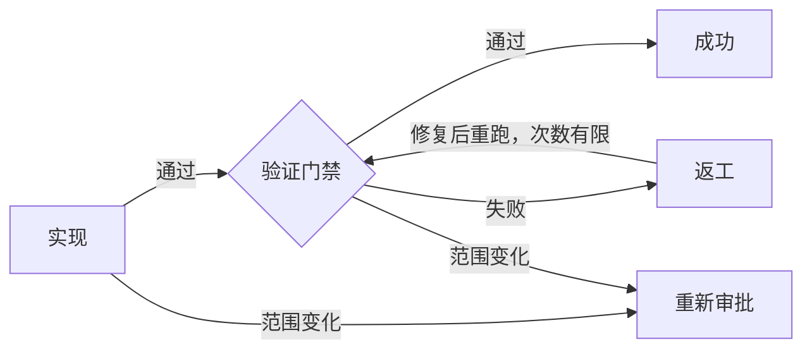

# 开发图编排 Skill

[English](README.md)

这是一个同时适用于 Codex 和 Claude Code 的 Skill：先判断开发任务的复杂度，再选择足够可靠且不过度的工作流。只有真正复杂的改动才创建持久化、可执行的开发图。

它不会把所有任务都塞进同一套重流程：

| 分类 | 典型信号 | 路线 |
| --- | --- | --- |
| Simple | 局部、机械、低风险、容易回滚 | `Implement -> focused Verify` |
| Standard | 范围明确的可观察行为变化 | `Spec -> Plan -> TDD batches -> Verify` |
| Complex | 跨模块、持久化、迁移、并发、权限、安全、构建或依赖风险 | 已审批 Spec/Plan + 可执行 JSON Graph |

## Graph Engineering：从流程图到可执行状态机

Complex 路线中的 JSON 不是用来展示的静态流程图，而是持久化状态机：

- 记录 `ready/running/passed/failed/blocked/skipped` 状态；
- 只允许沿 `pass/fail/blocked/scope_change` 边迁移；
- 重试和返工循环必须有明确上限；
- 历史只追加，并通过 SHA-256 哈希链防止静默篡改；
- 成功路径不能绕过必要门禁；
- 自动生成并刷新零依赖 SVG 预览。



## 依赖关系

| 组件 | 何时需要 | 用途 |
| --- | --- | --- |
| 本 Skill | 每个被路由的开发任务 | 分类与工作流规则 |
| Python 3.10+ **或** Node.js 18+ | 仅 Complex 路线 | 执行持久化开发图并生成预览 |
| Superpowers | 可选 | 提供 brainstorming、规划、TDD、调试和验证处理器 |
| `bounded-plan-execution` | 可选 | 有限预算地执行已审批 Plan |
| `AGENTS.md` / `CLAUDE.md` 模板 | 可选但推荐 | 确保其他开发流程之前先触发本 Skill |

**Superpowers 不是前置依赖。** 当前宿主没有某个配套 Skill 时，Agent 会直接执行同等纪律。Simple 和 Standard 不探测 Python 或 Node.js；两个图执行器只使用标准库，不需要安装 pip/npm 包。

如果希望启用可选集成，请参考 [Superpowers 官方安装说明](https://github.com/obra/superpowers#installation)。Claude Code 可执行 `/plugin install superpowers@claude-plugins-official`；Codex App 可在侧边栏 Plugins 中安装 Superpowers。

## 安装

可以直接对 AI 说：`把这个仓库安装成当前宿主的 orchestrating-development-graphs Skill。目标已存在就用 pull --ff-only 更新，否则先创建父目录再 clone；最后运行文档中的 smoke test，并告诉我安装的绝对路径。`

### Codex

可以让 Codex 使用 `skill-installer` 安装，也可以执行下面的手动命令。目标目录已经存在时不要重复 `git clone`，应使用更新命令。

PowerShell 首次安装：

```powershell
$skillParent = Join-Path $env:USERPROFILE ".codex\skills"
$skillRoot = Join-Path $skillParent "orchestrating-development-graphs"
New-Item -ItemType Directory -Force -Path $skillParent | Out-Null
git clone https://github.com/xincheng-1999/orchestrating-development-graphs.git $skillRoot
```

macOS/Linux 首次安装：

```bash
mkdir -p "$HOME/.codex/skills"
git clone https://github.com/xincheng-1999/orchestrating-development-graphs.git \
  "$HOME/.codex/skills/orchestrating-development-graphs"
```

更新已有安装：

```powershell
git -C "$env:USERPROFILE/.codex/skills/orchestrating-development-graphs" pull --ff-only
```

```bash
git -C "$HOME/.codex/skills/orchestrating-development-graphs" pull --ff-only
```

安装后重启 Codex 或新建任务，让 Skill 列表重新加载。

### Claude Code

PowerShell 首次用户级安装：

```powershell
$skillParent = Join-Path $env:USERPROFILE ".claude\skills"
$skillRoot = Join-Path $skillParent "orchestrating-development-graphs"
New-Item -ItemType Directory -Force -Path $skillParent | Out-Null
git clone https://github.com/xincheng-1999/orchestrating-development-graphs.git $skillRoot
```

macOS/Linux 首次用户级安装：

```bash
mkdir -p "$HOME/.claude/skills"
git clone https://github.com/xincheng-1999/orchestrating-development-graphs.git \
  "$HOME/.claude/skills/orchestrating-development-graphs"
```

更新已有用户级安装：

```powershell
git -C "$env:USERPROFILE/.claude/skills/orchestrating-development-graphs" pull --ff-only
```

```bash
git -C "$HOME/.claude/skills/orchestrating-development-graphs" pull --ff-only
```

如果团队需要随项目共享，在目标项目根目录添加 Git submodule。

PowerShell：

```powershell
New-Item -ItemType Directory -Force -Path ".claude\skills" | Out-Null
git submodule add https://github.com/xincheng-1999/orchestrating-development-graphs.git `
  ".claude/skills/orchestrating-development-graphs"
```

macOS/Linux：

```bash
mkdir -p .claude/skills
git submodule add https://github.com/xincheng-1999/orchestrating-development-graphs.git \
  .claude/skills/orchestrating-development-graphs
```

新建 Claude Code 会话后，可以运行 `/orchestrating-development-graphs`，也可以直接要求 Claude“使用开发图 Skill 分类这个开发任务”。

若希望每次开发改动都先经过分类，把对应模板复制到仓库根目录：

- Codex：[`examples/AGENTS.md`](examples/AGENTS.md)
- Claude Code：[`examples/CLAUDE.md`](examples/CLAUDE.md)

## Claude Code 兼容说明

- Claude Code 直接读取标准的 `SKILL.md`、`references/` 和 `scripts/`。
- `agents/openai.yaml` 只是 Codex 展示元数据，Claude Code 忽略它不影响核心功能。
- 配套 Skill 都是可选增强，Superpowers 不是前置依赖。需要时可以单独安装；没有时，本 Skill 会要求 Claude 自己执行等价的规划、调试、TDD 和完成前验证。
- Python 3.10+ 与 Node.js 18+ 命令不依赖宿主，也不需要安装 pip/npm 包。
- Claude Code 的仓库规则写在 `CLAUDE.md`，Codex 的仓库规则写在 `AGENTS.md`；本仓库提供了保持一致的模板。

## 验证安装

把实际安装目录解析成 `SKILL_ROOT` 后，可在任意工作目录运行以下任一 smoke test：

```powershell
python "<SKILL_ROOT>/scripts/dev_graph.py" validate "<SKILL_ROOT>/examples/development-graph.json"
node "<SKILL_ROOT>/scripts/dev_graph.mjs" validate "<SKILL_ROOT>/examples/development-graph.json"
```

可用的运行时都应输出 `VALID: <path>`。然后新建宿主会话，让它使用 `orchestrating-development-graphs` 分类“修改 README 一处错别字”；预期结果是 Simple，路线为 `Implement -> focused Verify`。

## 命令

Python 和 Node.js 提供相同命令：

```text
init <graph> [--output <path>] [--approval-evidence <text>]
validate <graph>
ready <graph>
start <graph> <node>
pass <graph> <node> --evidence <text> [--output <text>]
fail <graph> <node> --evidence <text> [--output <text>]
block <graph> <node> --evidence <text> [--output <text>]
scope-change <graph> <node> --evidence <text> [--output <text>]
status <graph>
render <graph> [--output <preview.svg>]
```

例如：

```powershell
python "<SKILL_ROOT>/scripts/dev_graph.py" validate "<TARGET_ROOT>/docs/superpowers/graphs/change.json"
python "<SKILL_ROOT>/scripts/dev_graph.py" render "<TARGET_ROOT>/docs/superpowers/graphs/change.json"

node "<SKILL_ROOT>/scripts/dev_graph.mjs" init "<TARGET_ROOT>/docs/superpowers/graphs/change.json"
node "<SKILL_ROOT>/scripts/dev_graph.mjs" ready "<TARGET_ROOT>/docs/superpowers/graphs/change.json"
```

`render path/name.json` 默认生成 `path/name.svg`。`init/start/pass/fail/block/scope-change` 修改状态时也会自动刷新同名 SVG。

## 安全边界

执行器只验证和持久化编排状态，不执行测试、构建、迁移、部署、Shell 或任意任务命令。Node.js 实现明确不导入 `node:child_process`。

它会拒绝无上限循环、缺少失败路线的 gate、绕过必要门禁的成功路径、非法状态快照、被篡改的历史链以及超出双运行时安全整数范围的重试次数。

## 测试

```powershell
python -m unittest discover -s tests -p "test_*.py" -v
node --test tests/test_dev_graph.mjs
```

测试覆盖静态校验、状态迁移、重试上限、重新审批、篡改检测、完成判定、SVG 安全、自动预览、规范化哈希和 Python/Node 双向互操作。

## License

[MIT](LICENSE)
